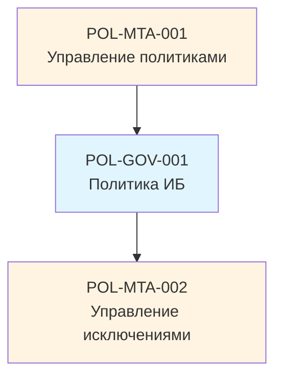
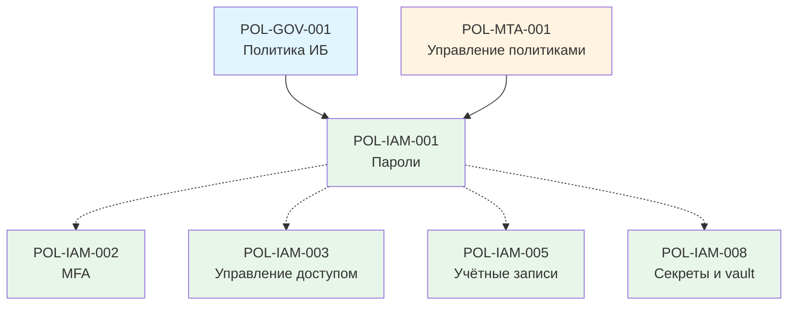
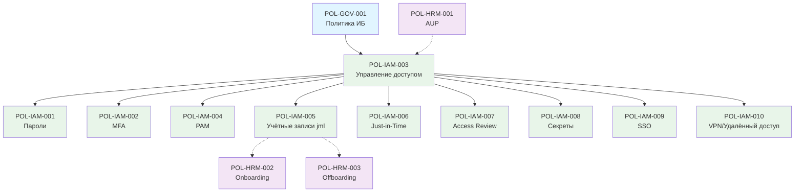
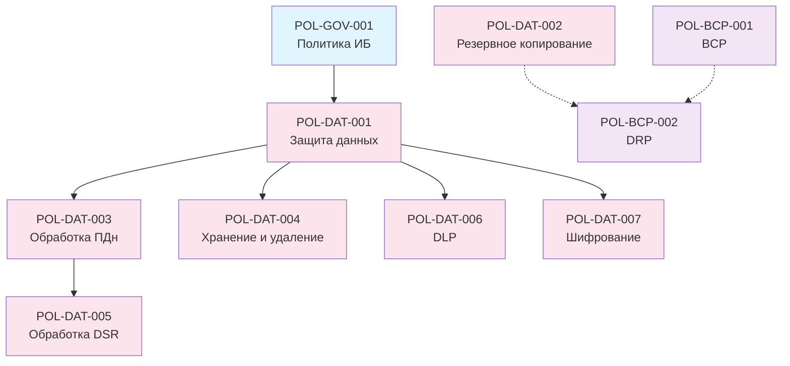
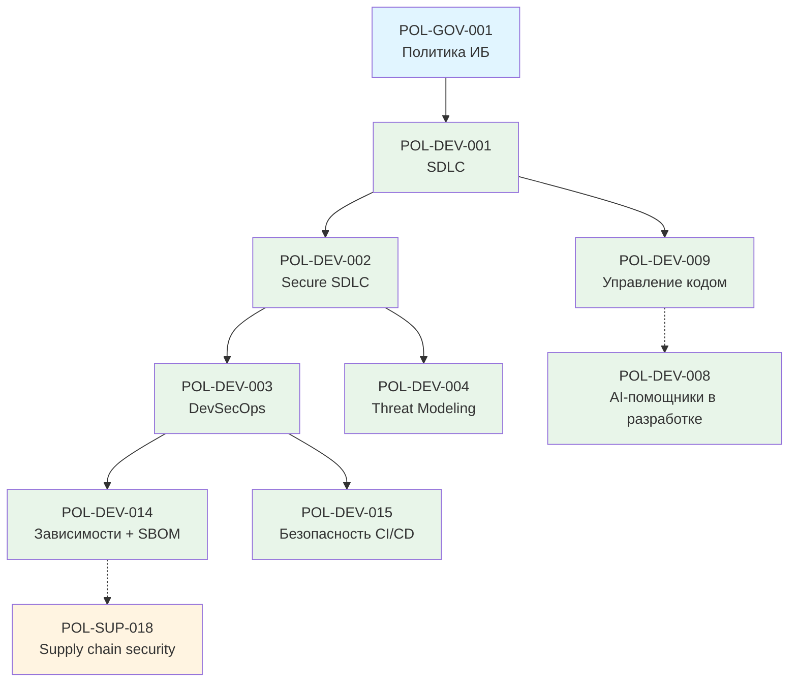

# Граф зависимостей между политиками

Каждая политика в библиотеке имеет `metadata.yml` с полями `depends_on` (что должно быть раньше) и `related_to` (с чем связана горизонтально). Этот документ визуализирует связи.

> **Автогенерация.** Графы в этом файле в перспективе будут автоматически генерироваться из `metadata.yml` всех шаблонов скриптом `tools/generate-dependency-graph.py`. Сейчас — ручной вариант для двух заполненных эталонов.

---

## Условные обозначения

- **Сплошная стрелка** (`-->`) — `depends_on`: должно быть внедрено раньше
- **Пунктирная стрелка** (`-.->`) — `related_to`: связано, но без жёсткого порядка
- Цвет узла отражает домен

---

## Этап 0: Основа

---

## Зонтичная политика → Политика паролей

---

## Управление доступом — полная картина (планируется)

---

## Кластер «Данные»

---

## Кластер «Разработка ПО»

---

## Как читать граф

1. **Сверху — фундамент**, снизу — производные
2. **Внедрять снизу вверх по сплошным стрелкам.** Если у политики есть `depends_on` X, без X её внедрять бессмысленно.
3. **Пунктирные стрелки** — это «следует знать о смежной политике», но порядок гибкий.
4. **Цвета доменов** помогают визуально различать области:
   - 🔵 Стратегические — фундамент
   - 🟡 Метаполитики — управление документами
   - 🟢 Управление доступом, разработка
   - 🟣 Персонал, BCP/DRP
   - 🩷 Данные

---

## Полный граф (планируется)

Полный граф для всех 24 доменов будет автоматически генерироваться по мере наполнения библиотеки. Сейчас он бы выглядел слишком разрежённо — большая часть узлов ещё не существует.

См. `tools/generate-dependency-graph.py` для генерации.
