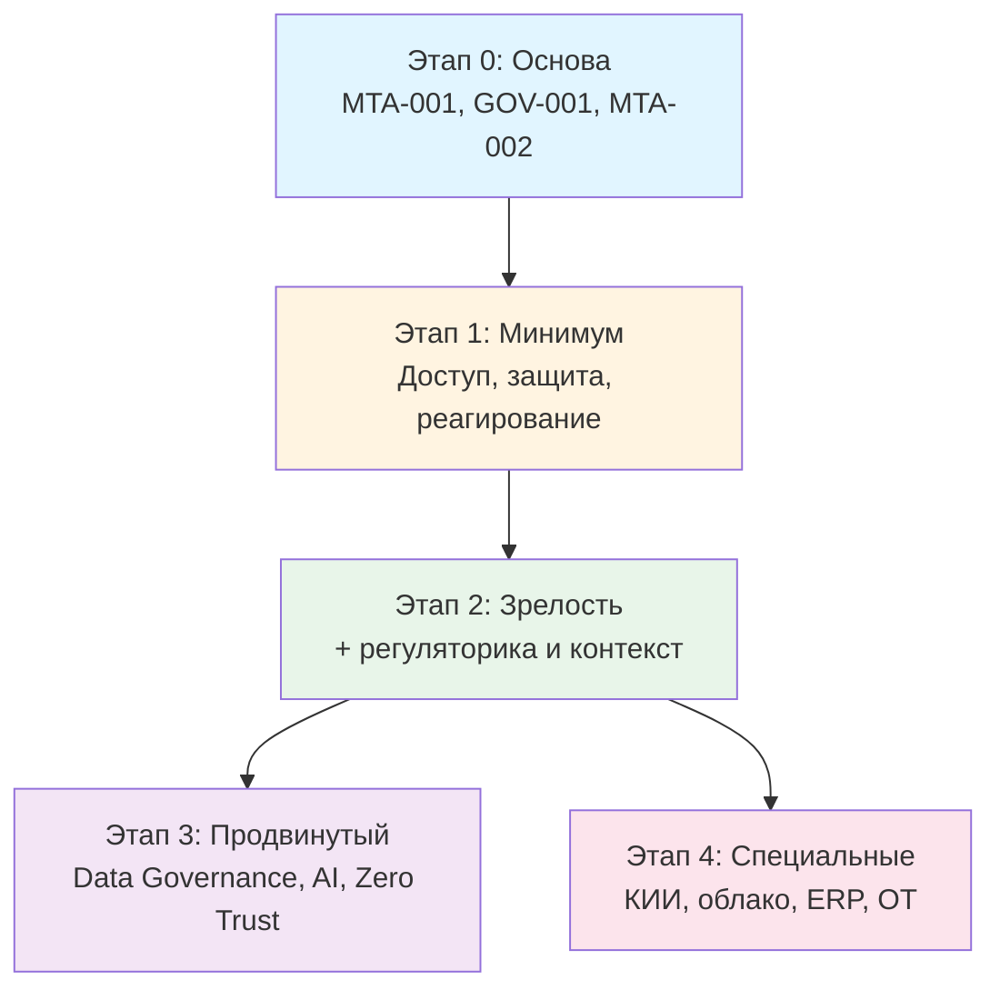

# Роудмэп: с чего начать и куда идти

Эта дорожная карта помогает понять, в каком порядке внедрять политики и куда двигаться по мере роста зрелости.

> **Главное правило:** не пытайтесь внедрить всё сразу. Каждая политика без её предшественников — пустой документ.

---

## Этап 0. Основа (1–2 месяца)

Без этого следующие этапы не имеют смысла.

| Политика | Что даёт |
|---|---|
| [POL-MTA-001 Управление политиками](../policies/24-meta-policies/policy-management/) | Правила, как писать и поддерживать все остальные документы |
| [POL-GOV-001 Политика ИБ](../policies/01-strategic/information-security-policy/) | Зонтичный документ с принципами и ролями |
| [POL-MTA-002 Управление исключениями](../policies/24-meta-policies/exception-management/) | Как и кто оформляет отступления от политик |

**Без этих трёх — любая другая политика рискует превратиться в формальную бумажку без поддержки.**

---

## Этап 1. Минимальный набор для рабочей системы ИБ (2–4 месяца)

Базовый «всё умею, ничего пока не теряю».

### Управление доступом
- [POL-IAM-001 Политика паролей](../policies/02-access-control/password-policy/)
- POL-IAM-002 Политика MFA
- POL-IAM-003 Политика управления доступом
- POL-IAM-005 Политика управления учётными записями (jml: join/move/leave)

### Защита данных
- POL-DAT-001 Политика защиты данных
- POL-DAT-002 Политика резервного копирования

### Безопасность процессов
- POL-SEC-001 Политика реагирования на инциденты ИБ
- POL-HRM-001 Политика допустимого использования (AUP)
- POL-OPS-001 Политика управления изменениями

### Идентификация
- POL-OPS-014 Политика именования (пользователи, устройства, группы)
- POL-SVC-001 Каталог сервисов + базовый SLA

---

## Этап 2. Зрелость и регуляторика (4–8 месяцев)

После минимума — закрытие конкретных потребностей.

### Если работаете с ПДн (а это все, у кого есть сотрудники)
- POL-DAT-003 Политика обработки ПДн
- POL-RUS-001 Документы по ФЗ-152
- POL-DAT-005 Политика обработки DSR (right-to-access, right-to-be-forgotten)

### Если работаете с подрядчиками
- POL-SUP-001 Политика аутсорсинга
- POL-SUP-005 Политика доступа подрядчиков
- POL-SUP-010 Политика приёмки работ

### Если разрабатываете ПО
- POL-DEV-001 Политика SDLC
- POL-DEV-002 Политика Secure SDLC
- POL-DEV-003 Политика DevSecOps
- POL-DEV-009 Политика управления исходным кодом
- POL-DEV-014 Политика управления зависимостями (с SBOM)

### Если есть IT-инфраструктура (а она есть)
- POL-OPS-002 Политика управления обновлениями (patch management)
- POL-OPS-003 Политика управления уязвимостями
- POL-OPS-006 Политика мониторинга и логирования
- POL-NET-001 Политика сетевой безопасности

---

## Этап 3. Продвинутый уровень (8+ месяцев)

Зрелые практики для организаций, у которых базовая ИБ уже работает.

### Управление данными как активом
- POL-DGV-001 Политика владения данными
- POL-DGV-002 Политика качества данных
- POL-DGV-003 Политика мастер-данных (MDM)

### Архитектура и развитие
- POL-ARC-001 Политика управления архитектурой
- POL-ARC-006 Политика модернизации систем
- POL-ARC-007 Политика управления техническим долгом

### Современные практики ИБ
- POL-SEC-007 Политика Threat Intelligence
- POL-SEC-008 Политика Threat Hunting
- POL-NET-002 Политика Zero Trust
- POL-SUP-018 Политика supply chain security (SBOM, signing)

### AI Governance
- POL-AIG-001 Политика использования AI
- POL-AIG-006 Политика разработки AI-решений
- POL-DEV-008 Политика использования AI-помощников в разработке

---

## Этап 4. Специальные направления (по необходимости)

Применимо не всем — только при наличии условий.

### Субъекты КИИ
- POL-RUS-004 Политика взаимодействия с НКЦКИ
- POL-RUS-005 Документы по 187-ФЗ

### Облачная инфраструктура
- POL-CLD-001 Политика использования облака
- POL-CLD-002 Политика безопасности облака (CSPM)
- POL-CLD-004 Политика FinOps

### Бизнес-приложения (ERP, CRM, 1C)
- POL-SAA-005 Политика SoD (segregation of duties)
- POL-SAA-007 Политика кастомизации ERP

### Промышленность / АСУ ТП
- POL-NET-012 Политика безопасности OT/ICS

---

## Графически

---

## Антипаттерны (как не надо)

### ❌ «Купить шаблон ISO 27001 за 50 политик и подписать все сразу»
Без понимания зависимостей и без интеграции в процессы — это просто бумаги для аудитора. После аудита всё забудут.

### ❌ «Скакать по этапам»
Внедрять Threat Hunting (этап 3), не имея реагирования на инциденты (этап 1) — бессмысленно.

### ❌ «Внедрить, забыть»
Без поддержания политики устаревают за 1–2 года. Заложите в годовой план пересмотр.

### ❌ «Внедрять то, что хочется, а не то, что нужно»
Симптом: «давайте напишем политику AI» при отсутствии политики паролей. AI без базовой гигиены — баловство.

### ❌ «Игнорировать реальность»
Если политика противоречит тому, как реально работают люди — либо политика, либо практика должна измениться. Третьего не дано.

---

## Куда дальше

- [MATURITY-LAYERS.md](./MATURITY-LAYERS.md) — детали маркеров ★ ◆ ▲
- [DEPENDENCIES.md](./DEPENDENCIES.md) — полный граф связей
- [BY-DOMAIN.md](./BY-DOMAIN.md) — все политики по доменам
- [../packs/minimum-starter/](../packs/minimum-starter/) — готовый стартовый пакет
